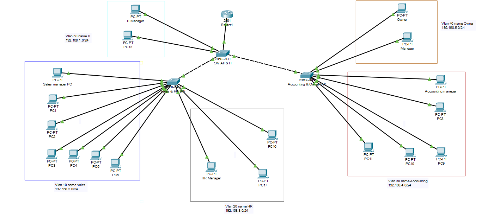

# Building and Securing a Small Network

## Project Overview
This project involves designing, configuring, and securing a small network using Cisco devices. The tasks are divided into four weeks, each focusing on a different aspect of network implementation and security.

## Team Members
- Mohab
- Mohamed Hamada
- Moataz
- Safiya Abdelbaky 
- Sara
- Yassin

---

## Network Design Screenshot
Here is a screenshot of the network design from Cisco Packet Tracer:

---

## Week 1: Network Design and Configuration
### Task
- Design a small network using Cisco devices.
- Define the network topology, IP addressing scheme, and device configurations.

### Deliverables
- Network design diagram
- IP addressing table
- Initial configuration scripts for routers and switches

---

## Week 2: VLANs and Inter-VLAN Routing
### Task
- Implement VLANs in the network.
- Configure VLANs, VLAN trunks, and Inter-VLAN routing using Router-on-a-Stick.

### Deliverables
- VLAN configuration scripts
- Inter-VLAN routing setup documentation
- VLAN troubleshooting report

---

## Week 3: Network Security Implementation
### Task
- Implement security features including port security, ACLs, and basic firewall rules.
- Configure network security on switches and routers.

### Deliverables
- Security configuration scripts
- Security policy document
- Report on the effectiveness of the implemented security measures

---

## Week 4: Final Testing and Reporting
### Task
- Test network functionality, security, and connectivity.
- Prepare a final report including network performance, security assessment, and a presentation.

### Deliverables
- Final report
- Presentation slides
- Test results
